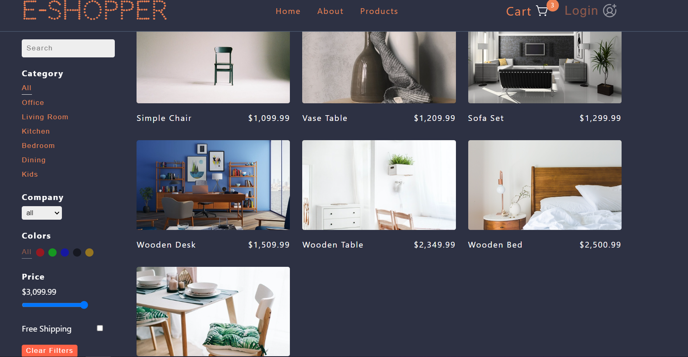

# Getting Started E-SHOPPER with Create React App

This project was bootstrapped with [Create React App](https://github.com/facebook/create-react-app).

## Is used in the project

- Context API
- useReducer, useEffect, useState
- react-router-dom
- grid/list view
- many options of filter products
- own slider

## Available Scripts

In the project directory, you can run:

### `npm start`

Runs the app in the development mode.\
Open [http://localhost:3000](http://localhost:3000) to view it in your browser.

The page will reload when you make changes.\
You may also see any lint errors in the console.
